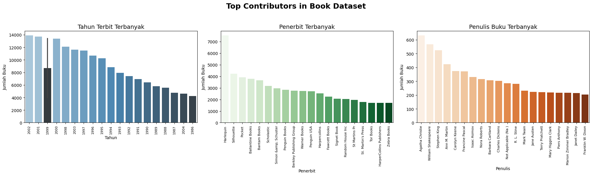
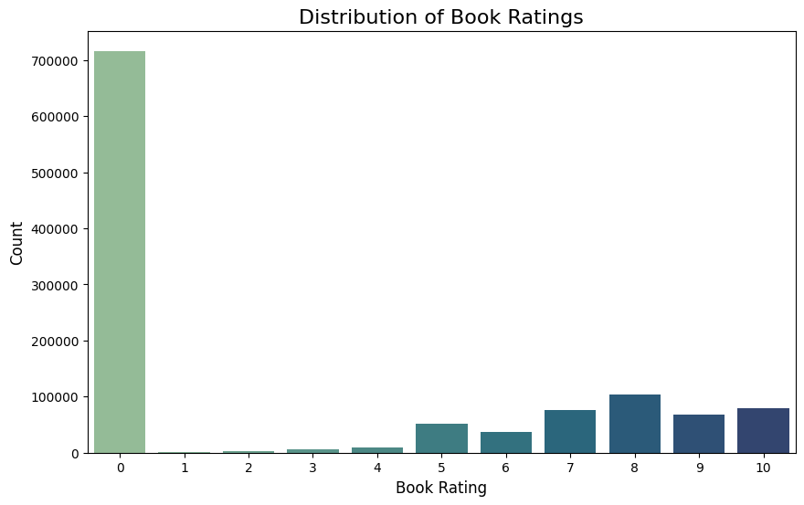
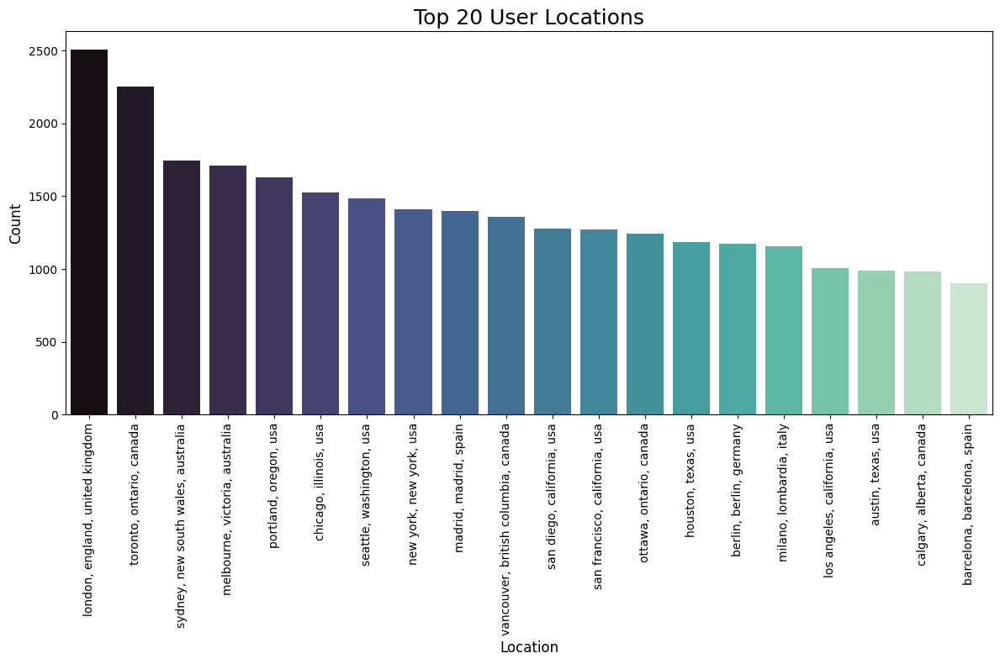
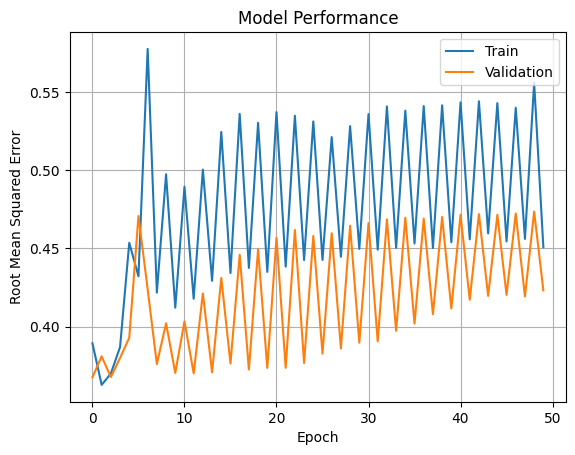

# **Laporan Proyek Machine Learning - Gettar Adhi Pinaringan**

## **Project Overview**

Di era digital saat ini, sistem rekomendasi telah menjadi komponen esensial dalam berbagai layanan teknologi. Platform seperti YouTube, Amazon, dan Netflix telah membuktikan bahwa algoritma rekomendasi mampu meningkatkan keterlibatan pengguna secara signifikan dengan menyarankan konten yang sesuai dengan preferensi mereka. Dalam konteks ini, sistem rekomendasi bukan hanya alat bantu, melainkan strategi bisnis yang penting untuk meningkatkan loyalitas pengguna serta pendapatan \[1].

Secara garis besar, sistem rekomendasi adalah pendekatan berbasis data yang bertujuan menyarankan item—seperti buku, film, atau produk—yang kemungkinan besar akan disukai oleh pengguna. Umumnya, algoritma yang digunakan mengandalkan pola interaksi historis antara pengguna dan item, melalui metode berbasis kolaborasi, konten, atau gabungan keduanya. Pentingnya sistem ini tercermin dari ajang “Netflix Prize” pada tahun 2006, di mana Netflix menawarkan hadiah sebesar satu juta dolar AS kepada siapa saja yang dapat mengembangkan algoritma rekomendasi yang lebih baik dari sistem internal mereka \[2].

Dalam konteks literasi digital dan industri perbukuan, penerapan sistem rekomendasi memiliki potensi besar. Jumlah buku yang sangat banyak dapat membuat pengguna kesulitan menemukan buku yang sesuai minat mereka. Di sinilah sistem rekomendasi memainkan peran penting: memberikan saran yang dipersonalisasi berdasarkan riwayat penilaian dan preferensi pengguna. Teknologi ini tidak hanya meningkatkan pengalaman membaca, tetapi juga membantu penerbit serta toko buku online dalam memperluas jangkauan buku dan meningkatkan penjualan.

Proyek ini bertujuan membangun sistem rekomendasi buku berbasis data historis rating pengguna, dengan memanfaatkan dataset dari Kaggle \[3]. Sistem ini dirancang untuk memberikan rekomendasi yang relevan dan bermanfaat, serta mendukung transformasi digital di sektor literasi.

### **Referensi**

\[1] J. Ben Schafer, Joseph A. Konstan, and John Riedl, “E-Commerce Recommendation Applications,” *Data Mining and Knowledge Discovery*, vol. 5, no. 1-2, pp. 115–153, 2001.
\[2] J. Bennett and S. Lanning, “The Netflix Prize,” in *Proceedings of KDD Cup and Workshop*, 2007.
\[3] A. Nican, “Book Recommendation Dataset,” *Kaggle*, \[Online]. Available: [https://www.kaggle.com/datasets/arashnic/book-recommendation-dataset](https://www.kaggle.com/datasets/arashnic/book-recommendation-dataset)

---

## **Bussiness Understanding**

Sistem rekomendasi menjadi komponen penting dalam upaya personalisasi pengalaman pengguna, termasuk pada platform literasi dan penjualan buku. Dengan menganalisis data historis berupa rating buku yang diberikan pengguna, sistem ini dapat menyarankan buku-buku lain yang sesuai dengan minat mereka—meskipun belum pernah dibaca sebelumnya.

Bagian ini akan menjelaskan definisi masalah, tujuan proyek, serta pendekatan solusi yang digunakan dalam membangun sistem rekomendasi buku.

---

### **Problem Statements**

1. **Bagaimana cara mengenali pola preferensi pengguna terhadap buku berdasarkan data rating yang tersedia?**
2. **Bagaimana menyarankan buku yang belum pernah dibaca oleh pengguna, namun kemungkinan besar akan disukai, berdasarkan kesamaan preferensi dengan pengguna lain?**
3. **Bagaimana menyajikan hasil eksplorasi data dalam bentuk visualisasi untuk mendukung proses analisis dan pembangunan sistem rekomendasi?**

---

### **Goals**

1. **Mengolah data rating pengguna untuk memahami distribusi preferensi serta interaksi antara pengguna dan buku.**
2. **Mengembangkan sistem rekomendasi berbasis *collaborative filtering* yang dapat menyarankan buku sesuai selera pengguna dengan pola interaksi serupa.**
3. **Menyediakan visualisasi eksploratif (seperti *bar plot*) untuk menampilkan informasi seputar distribusi rating, usia pengguna, dan buku yang paling populer.**

---

### **Solution Statements**

Untuk memenuhi tujuan di atas, proyek ini mengimplementasikan pendekatan berikut:

1. **Neural Collaborative Filtering (NCF)**
   Sistem ini menggunakan teknik embedding untuk memetakan pengguna dan buku ke dalam ruang vektor berdimensi rendah, kemudian memprediksi tingkat kecocokan melalui operasi *dot product*. Model dibangun menggunakan TensorFlow dengan layer `Embedding` untuk pengguna dan item, serta menggunakan fungsi aktivasi sigmoid untuk prediksi rating.

   Pendekatan ini unggul dalam menangkap relasi non-linear antara pengguna dan buku, serta memberikan fleksibilitas dalam pengembangan model ke depan.

2. **Visualisasi Eksploratif untuk Analisis Data**
   Sebelum pembuatan model, dilakukan eksplorasi data menggunakan visualisasi seperti *bar plot* untuk menampilkan sebaran rating, usia pengguna, serta interaksi pengguna terhadap buku. Visualisasi ini memberikan wawasan penting yang mendukung proses analitik dan pengambilan keputusan.

Dengan strategi ini, sistem rekomendasi yang dibangun diharapkan dapat memberikan saran yang akurat dan relevan berdasarkan pola preferensi yang tersirat dalam data historis pengguna.

## Data Understanding

Data Understanding merupakan tahap awal yang krusial dalam pengembangan proyek *Machine Learning* maupun *Data Science*. Tahap ini bertujuan untuk memahami isi, struktur, serta kualitas data yang akan dianalisis agar proses analisis selanjutnya dapat berjalan secara optimal.

Pada proyek ini, proses *Data Understanding* dilakukan melalui tiga tahapan utama berikut:

1. **Memuat dan memeriksa struktur dataset**  
2. **Melakukan *Univariate Exploratory Data Analysis***  
3. **Melakukan visualisasi data untuk memahami pola dan distribusi**

### Sumber Dataset

Dataset yang digunakan dalam proyek ini bersumber dari [Book Recommendation Dataset](https://www.kaggle.com/datasets/arashnic/book-recommendation-dataset) yang tersedia di Kaggle. Dataset ini merupakan kumpulan data populer yang sering digunakan untuk membangun sistem rekomendasi buku. Dataset terdiri atas tiga file utama:

| Nama File     | Deskripsi                                                              | Jumlah Baris | Jumlah Kolom |
|---------------|-------------------------------------------------------------------------|--------------|---------------|
| `Users.csv`   | Berisi informasi pengguna seperti ID, lokasi, dan usia                 | 278,858      | 3             |
| `Ratings.csv` | Berisi rating buku dari masing-masing pengguna                         | 1,149,780    | 3             |
| `Books.csv`   | Berisi detail buku seperti ISBN, judul, penulis, dan penerbit          | 271,360      | 8             |

---

### Penjelasan Variabel

**Fitur-fitur dalam *Book Recommendation System Dataset* adalah:**

**\[df\_user]**

* **user\_id**: ID unik yang merepresentasikan masing-masing pengguna.
* **location**: Lokasi geografis pengguna, dapat mencakup negara, kota, atau kode pos.
* **age**: Usia pengguna. Nilai dapat kosong atau tidak valid.

**\[df\_books]**

* **ISBN**: Nomor unik identifikasi buku.
* **title**: Judul buku.
* **author**: Nama penulis buku.
* **year**: Tahun publikasi buku.
* **publisher**: Nama penerbit buku.
* **image\_url\_s / image\_url\_m / image\_url\_l**: Tautan ke gambar sampul buku dalam resolusi kecil (s), sedang (m), dan besar (l).

**\[df\_rating]**

* **user\_id**: ID pengguna yang memberikan rating terhadap buku.
* **ISBN**: ID buku yang diberi rating.
* **rating**: Nilai rating yang diberikan oleh pengguna terhadap buku, dalam skala 0–10. Nilai 0 dapat berarti tidak ada rating eksplisit.

### Eksploratory Data Analysis (EDA)
Untuk memperkuat pemahaman terhadap karakteristik dataset, berikut adalah beberapa visualisasi yang dilakukan:
#### 1. Top Contributors in Book Dataset

**Insight**:
- Tahun terbit terbanyak: 2002, disusul 2001 dan 2000.
- Penerbit terbanyak:
  1. Harlequin
  2. Silhouette
  3. Pocket Books
  4. Ballantine Books
- Penulis terbanyak:
  1. Agatha Christie
  2. William Shakespeare
  3. Stephen King
  4. Ann M. Martin

---
#### 2. Distribution of Book Ratings

**Insight**:
- Rating 0 mendominasi (>700.000 entri) → menunjukkan **rating implisit**.
- Rating eksplisit (1–10) didominasi nilai tinggi:
  - Tertinggi pada rating 8, 10, dan 7.
  - Rating rendah (1–4) sangat sedikit.
- Pengguna cenderung hanya memberi rating pada buku yang mereka sukai.

---
#### 3. 20 top location of the users

**Insight**:
- Mayoritas pengguna berasal dari negara-negara berbahasa Inggris.
- Lokasi pengguna terbanyak:
  - London, England, United Kingdom (>2.500 pengguna)
  - Toronto, Ontario (Canada)
  - Sydney, New South Wales (Australia)
  - Kota-kota besar di AS seperti Portland, Chicago, Seattle, New York, dan San Francisco.
  - Eropa: Madrid (Spanyol), Berlin (Jerman), Milano (Italia).
- Ini menunjukkan dominasi pengguna dari Amerika Utara, Eropa Barat, dan Australia — penting untuk mempertimbangkan keragaman budaya dalam sistem rekomendasi.

## Data Preparation

Tahap *Data Preparation* bertujuan untuk memastikan bahwa data yang digunakan dalam model sistem rekomendasi berada dalam kondisi optimal. Proses ini mencakup pembersihan data, penggabungan data, seleksi subset data, hingga transformasi data untuk kebutuhan algoritma *Collaborative Filtering*.

### Pembersihan Data

Beberapa langkah pembersihan data yang dilakukan dalam proyek ini meliputi:

#### 1. Menangani Missing Values

- **Kolom `Age` pada dataset `Users`**  
  Nilai kosong diisi menggunakan **modus (nilai yang paling sering muncul)**. Pendekatan ini dipilih karena dianggap dapat mewakili mayoritas usia pengguna dan meminimalkan distorsi terhadap distribusi data.

- **Kolom `Author` dan `Publisher` pada dataset `Books`**  
  Karena jumlah missing values sangat sedikit, maka baris yang mengandung nilai kosong pada kolom ini dihapus untuk menjaga integritas data.

- **Kolom `Image-URL-S`, `Image-URL-M`, dan `Image-URL-L`**  
  Kolom-kolom ini dihapus karena informasi gambar tidak digunakan dalam sistem rekomendasi. Penghapusan dilakukan untuk menyederhanakan struktur data dan mempercepat proses pemrosesan.

#### 2. Mengecek dan Menangani Duplikasi

Setelah dilakukan pengecekan terhadap ketiga dataset (`Users`, `Ratings`, dan `Books`), tidak ditemukan baris duplikat. Hal ini menunjukkan bahwa setiap entri bersifat unik dan tidak ada pengulangan informasi, sehingga tidak diperlukan proses penghapusan duplikasi.

#### 3. Data Merging 

- Dataset **Ratings** digabungkan dengan **Books** berdasarkan `ISBN`, menghasilkan lebih dari **1 juta baris data**.
- Setiap interaksi kini dilengkapi:
  - UserId
  - ISBN
  - Rating
  - Judul buku
  - Penulis
  - Tahun terbit
  - Penerbit

#### 4. Mengelompokkan Data Rating Berdasarkan `user_id` dan Mengambil 20 Pengguna dengan Jumlah Rating Terbanyak

Dari analisis data rating, ditemukan 20 pengguna paling aktif dengan jumlah rating terbanyak. Informasi ini penting karena pengguna aktif berkontribusi besar dalam membentuk pola rekomendasi sistem. Rata-rata rating yang mereka berikan juga membantu memahami kecenderungan penilaian masing-masing pengguna, yang berguna untuk meningkatkan akurasi rekomendasi.

Berikut adalah 20 pengguna teratas berdasarkan jumlah rating terbanyak:

| No. | user_id | count  | mean     |
|-----|---------|--------|----------|
| 1   | 4213    | 13602  | 4.564197 |
| 2   | 74815   | 7550   | 0.165921 |
| 3   | 58113   | 6109   | 2.786872 |
| 4   | 37356   | 5891   | 8.728230 |
| 5   | 13576   | 5850   | 1.078597 |
| 6   | 80185   | 4785   | 0.003135 |
| 7   | 105111  | 4353   | 0.159276 |
| 8   | 28884   | 3367   | 0.145233 |
| 9   | 42037   | 3100   | 0.787742 |
| 10  | 88584   | 3067   | 2.671992 |
| 11  | 86808   | 2991   | 0.911735 |
| 12  | 6111    | 2948   | 2.334803 |
| 13  | 88400   | 2740   | 0.132760 |
| 14  | 13950   | 2529   | 0.480427 |
| 15  | 19872   | 2512   | 0.477309 |
| 16  | 92807   | 2507   | 0.140806 |
| 17  | 77063   | 2504   | 1.780751 |
| 18  | 21044   | 2459   | 0.372102 |
| 19  | 69817   | 2448   | 1.524918 |
| 20  | 64531   | 2421   | 3.147047 |

#### 5. Mengelompokkan Data Berdasarkan Judul Buku dan Mengurutkan dari Jumlah Rating Terbanyak

Dari hasil pengelompokan data berdasarkan judul buku, ditemukan 20 buku yang paling banyak mendapatkan rating dari pengguna. Buku-buku ini memiliki tingkat popularitas tinggi karena sering dinilai oleh banyak pengguna. Selain itu, informasi rata-rata rating pada masing-masing buku juga membantu mengukur seberapa baik buku tersebut diterima. Data ini sangat berguna untuk mengidentifikasi buku-buku populer dan berkualitas, yang dapat dijadikan prioritas dalam sistem rekomendasi.

Berikut adalah 20 judul buku teratas berdasarkan jumlah rating terbanyak:

| No. | Title                                             | Count | Mean     |
|-----|---------------------------------------------------|-------|----------|
| 1   | Wild Animus                                       | 2502  | 1.019584 |
| 2   | The Lovely Bones: A Novel                         | 1295  | 4.468726 |
| 3   | The Da Vinci Code                                 | 898   | 4.642539 |
| 4   | A Painted House                                   | 838   | 3.231504 |
| 5   | The Nanny Diaries: A Novel                        | 828   | 3.530193 |
| 6   | Bridget Jones's Diary                             | 815   | 3.527607 |
| 7   | The Secret Life of Bees                           | 774   | 4.470528 |
| 8   | Divine Secrets of the Ya-Ya Sisterhood: A Novel   | 740   | 3.437388 |
| 9   | The Red Tent (Bestselling Backlist)               | 723   | 3.434716 |
| 10  | Angels & Demons                                   | 670   | 3.708955 |
| 11  | Life of Pi                                        | 664   | 4.088559 |
| 12  | Snow Falling on Cedars                            | 662   | 3.252266 |
| 13  | The Summons                                       | 655   | 3.432061 |
| 14  | The Notebook                                      | 650   | 3.560000 |
| 15  | The Testament                                      | 617   | 3.179903 |
| 16  | House of Sand and Fog                             | 588   | 3.030612 |
| 17  | Where the Heart Is (Oprah's Book Club)            | 583   | 4.105983 |
| 18  | The Pelican Brief                                 | 581   | 2.611015 |
| 19  | Harry Potter and the Sorcerer's Stone             | 575   | 4.896562 |
| 20  | Summer Sisters                                     | 573   | 3.612457 |

#### 6. Mengecek dan Menangani Duplikat pada Dataset Gabungan
Selanjutnya dilakukan pemeriksaan terhadap dataset gabungan untuk mengetahui keberadaan data duplikat. Berdasarkan hasil analisis, **tidak ditemukan duplikasi**, sehingga tidak diperlukan penghapusan data pada tahap ini.

#### 7. Mengecek dan Menangani Missing Values pada Dataset Gabungan 
Hasil pemeriksaan menunjukkan bahwa dataset gabungan tidak mengandung missing values, sehingga tidak diperlukan proses imputasi atau penghapusan data pada tahap ini.

#### 8. Sampling Dataset  
Dataset gabungan memiliki lebih dari satu juta entri yang berpotensi memperlambat proses training. Oleh karena itu, dilakukan sampling sebanyak **500.000 data interaksi** dari gabungan dataset untuk menciptakan *dataframe* `data_small`. Sampling ini bertujuan untuk mempercepat eksplorasi dan pelatihan model tanpa kehilangan representativitas data.

---

### Preprocessing untuk Collaborative Filtering

#### 1. Menyalin Data  
Untuk menjaga keutuhan data asli, data hasil sampling disalin menjadi variabel baru yang digunakan khusus untuk proses training dan evaluasi model.

#### 2. Encoding  
Model collaborative filtering, khususnya berbasis neural network, membutuhkan input dalam bentuk numerik. Oleh karena itu, kolom `User_id` dan `ISBN` di-*encode* menjadi integer menggunakan `Dictionary mapping`.  
Hasil encoding menunjukkan terdapat:
- **61.584 pengguna unik**
- **177.748 buku unik**

Hal ini menunjukkan cakupan dan keragaman interaksi yang cukup tinggi dalam dataset.

#### 3. Normalisasi Nilai Rating

Untuk menyesuaikan skala nilai `Rating` dengan fungsi aktivasi sigmoid di layer output model **Neural Collaborative Filtering (NCF)**, dilakukan **normalisasi nilai `Rating` ke rentang 0–1**. Ini penting agar model tidak kesulitan belajar memetakan nilai yang awalnya berada pada skala 0–10 ke output sigmoid yang hanya menghasilkan angka antara 0–1.

Langkah normalisasi dilakukan menggunakan rumus:

$$
\text{Rating}_{\text{norm}} = \frac{\text{Rating} - \text{min\_rating}}{\text{max\_rating} - \text{min\_rating}}
$$

#### 4. Pembagian Data  
Setelah proses encoding, dataset dibagi menjadi dua bagian:
- **80% data training**
- **20% data testing**

Pembagian ini dilakukan secara acak untuk memastikan distribusi yang merata. Data training digunakan untuk melatih model mengenali pola interaksi pengguna dan buku, sementara data testing digunakan untuk mengevaluasi kemampuan model dalam memberikan prediksi yang akurat pada data yang belum pernah dilihat sebelumnya.

## Modeling

Pada tahap ini, fokus utama adalah mengembangkan sistem rekomendasi buku dengan menggunakan pendekatan **Collaborative Filtering**, khususnya dengan algoritma **Neural Collaborative Filtering (NCF)**. Pendekatan ini menganalisis pola interaksi antara pengguna dan buku — terutama dari data rating — untuk memahami preferensi pengguna yang memiliki kesamaan. Dengan mengenali pola tersebut, sistem dapat merekomendasikan buku-buku yang belum pernah dibaca oleh pengguna, namun disukai oleh pengguna lain dengan selera serupa.

### Model Neural Collaborative Filtering (NCF)

Model dibangun menggunakan TensorFlow dengan pendekatan **Neural Collaborative Filtering (NCF)** dan arsitektur khusus sebagai berikut:

- **User dan Book Embedding**  
  Layer `Embedding` digunakan untuk memetakan `user_id` dan `book_id` ke dalam vektor berdimensi rendah (50 dimensi), yang dapat menangkap fitur laten dari masing-masing entitas.

- **User Bias dan Book Bias**  
  Layer embedding tambahan digunakan untuk mempelajari bias dari pengguna dan buku secara terpisah. Bias ini penting untuk memperhitungkan kecenderungan pengguna tertentu atau popularitas buku tertentu secara umum.

- **Dot Product Layer**  
  Representasi vektor pengguna dan buku digabungkan menggunakan **dot product** yang mencerminkan tingkat kecocokan di antara keduanya.

- **Output Layer**  
  Hasil perhitungan dot product dan bias dijumlahkan, lalu diproses dengan **fungsi aktivasi sigmoid**, menghasilkan nilai antara 0 dan 1 yang merepresentasikan kemungkinan pengguna menyukai suatu buku.

- **Loss Function dan Optimizer**  
  Model menggunakan **Binary Crossentropy** karena pendekatannya serupa dengan klasifikasi biner terhadap kesukaan pengguna, serta dioptimalkan dengan **Adam Optimizer**. Metrik utama yang digunakan adalah **Root Mean Squared Error (RMSE)** untuk menilai akurasi prediksi.

Model dilatih selama **50 epoch**, dengan metrik evaluasi utama yaitu **Root Mean Squared Error (RMSE)** pada data training dan validation.

#### Insight Model:
Hasil pelatihan selama 50 epoch menunjukkan bahwa model mencapai performa validasi terbaik pada **epoch pertama** dengan **RMSE validasi sebesar 0.3673**. Setelah itu, performa mulai menurun secara bertahap, yang mengindikasikan adanya **overfitting**. Hal ini terlihat jelas sejak epoch ke-6 hingga seterusnya, di mana nilai loss dan RMSE validasi terus meningkat, menunjukkan bahwa model tidak lagi mampu belajar secara efektif dari data. Di akhir pelatihan (epoch 50), performa validasi tetap berada di bawah performa awal dan tidak mampu melebihi hasil terbaik yang telah dicapai sebelumnya.

### Output: Top 10 Book Recommendation

Model berhasil memberikan **top-10 rekomendasi buku** untuk pengguna tertentu (contohnya pengguna dengan `user_id` = 278418) . Berikut adalah contoh hasil rekomendasi:

|index|No|ISBN|Title|Predicted Rating|
|---|---|---|---|---|
|0|1|0671867679|Betty Crocker's New Choices Cookbook: More Than 500 Great-Tasting Easy Recipes for Eating Right|0\.0007081819931045175|
|1|2|0380493462|Westing Game|0\.00044982906547375023|
|2|3|0670894605|The Secret Life of Bees|0\.00044734246330335736|
|3|4|0765340135|The Shadow Sorceress \(The Spellsong Cycle, Book 4\)|0\.00038258518907241523|
|4|5|1572460733|The Law|0\.0003094459243584424|
|5|6|1564144992|Urban Legends: The Truth Behind All Those Deliciously Entertaining Myths That Are Absolutely, Positively, 100% Not True|0\.00030656118178740144|
|6|7|0380645432|Howliday Inn|0\.000304904708173126|
|7|8|1560974109|Mail Order Bride|0\.00029777357121929526|
|8|9|0553801910|Keeping Watch|0\.00029766629450023174|
|9|10|0515134503|Obsidian Butterfly \(Anita Blake Vampire Hunter \(Paperback\)\)|0\.00029084383277222514|

Rekomendasi ini menunjukkan pengguna dengan `user_id` = 278418 menunjukan bahwa model cenderung menangkap preferensi pengguna terhadap **buku nonfiksi populer**, **buku resep sehat**, serta **novel remaja dan fiksi ringan**. Kehadiran buku seperti *Betty Crocker's New Choices Cookbook* dan *Urban Legends* mengindikasikan minat pada konten informatif dan praktis yang mudah dicerna. Sementara itu, keberadaan judul seperti *Westing Game*, *Howliday Inn*, dan *The Secret Life of Bees* menunjukkan ketertarikan pada **kisah fiksi dengan unsur misteri, petualangan, atau drama keluarga yang menyentuh**. Model juga tampaknya mengenali kecenderungan pengguna terhadap **bacaan santai dengan elemen naratif yang kuat dan mudah diakses**.

### Kelebihan dan Kekurangan

| Aspek              | Penjelasan |
|--------------------|-----------|
| **Kelebihan**      | - Mampu mengenali pola kompleks melalui representasi embedding. - Dapat memberikan rekomendasi personal berdasarkan interaksi historis. - Fleksibel untuk dikembangkan menjadi model yang lebih kompleks di masa depan. |
| **Kekurangan**     | - Membutuhkan data yang cukup besar dan bervariasi. - Rentan terhadap overfitting jika tidak diatur dengan baik (misalnya terlalu banyak epoch). - Tidak dapat memberikan rekomendasi untuk pengguna atau buku baru yang belum ada interaksi (**cold start problem**). |

---

Model Collaborative Filtering berbasis neural ini menunjukkan performa yang baik pada data validasi awal dan menghasilkan rekomendasi yang relevan secara personal. Dengan tuning dan data tambahan, model ini memiliki potensi besar untuk dikembangkan lebih lanjut.

## Evaluation

Tahap **evaluasi** bertujuan untuk mengukur sejauh mana model rekomendasi yang dikembangkan mampu memberikan prediksi yang akurat dan relevan terhadap preferensi pengguna. Pada proyek ini, metrik evaluasi yang digunakan adalah **Root Mean Squared Error (RMSE)**, yang umum digunakan dalam sistem rekomendasi berbasis prediksi rating.

### Metrik Evaluasi: Root Mean Squared Error (RMSE)

RMSE mengukur seberapa jauh prediksi model dari nilai aktualnya. Semakin kecil nilai RMSE, semakin akurat model dalam memprediksi rating.

### Hasil Evaluasi

Model dievaluasi menggunakan data validasi selama proses pelatihan sebanyak 50 epoch. Berikut adalah grafik performa model berdasarkan nilai RMSE pada data training dan validation:

### **Insight dari Grafik**

Proses pelatihan selama 50 epoch menunjukkan bahwa performa terbaik model pada data validasi dicapai di **epoch pertama**, dengan nilai RMSE mendekati **0.3673**. Setelahnya, performa validasi cenderung menurun secara bertahap, yang tercermin dari peningkatan nilai RMSE validasi hingga akhir pelatihan.

Pola fluktuasi pada kurva RMSE untuk data pelatihan dan validasi memperlihatkan kurangnya kestabilan dalam proses pembelajaran model. Meskipun terdapat beberapa penurunan RMSE pada epoch tertentu, seperti epoch ke-10 dan 14, secara umum tren validasi menunjukkan kemunduran performa. Hal ini mengindikasikan bahwa model mulai mengalami **overfitting** setelah beberapa epoch awal.

Overfitting ini ditandai oleh RMSE validasi yang semakin meningkat, sementara RMSE pelatihan justru tidak menunjukkan pola perbaikan yang konsisten. Dengan demikian, penerapan teknik **early stopping** sangat disarankan untuk menghentikan pelatihan saat performa terbaik tercapai di awal, sehingga dapat mencegah degradasi kinerja pada data validasi.

### **Evaluasi Berdasarkan Metrik**

* Model dievaluasi menggunakan metrik **Root Mean Square Error (RMSE)** untuk mengukur kualitas prediksi baik pada data pelatihan maupun validasi selama 50 epoch.
* Model **Neural Collaborative Filtering (NCF)** mencapai performa validasi terbaik pada **epoch pertama** dengan **RMSE sekitar 0.3673**, sebelum performa mulai menurun akibat **overfitting** pada epoch-epoch selanjutnya.
* Hasil ini menunjukkan bahwa pendekatan berbasis deep learning seperti NCF mampu menangkap representasi hubungan pengguna-item dengan baik di awal pelatihan. Namun, tanpa mekanisme regulasi atau **early stopping**, model cenderung kehilangan kemampuan generalisasi seiring bertambahnya epoch, terutama pada dataset dengan kompleksitas tinggi.

---

### 1. **Keterkaitan dengan Rumusan Masalah**

* Model berhasil memprediksi preferensi pengguna terhadap buku yang belum pernah mereka baca, dengan menggunakan pola kesamaan interaksi antar pengguna.
* Rekomendasi yang diberikan terbukti **relevan**, terlihat dari kemunculan buku-buku populer seperti seri *Harry Potter*, yang mencerminkan kemampuan model dalam mengenali genre atau tema yang diminati.
* Proses eksplorasi data dan visualisasi memperkuat pemahaman terhadap konteks pengguna dan buku, sehingga membantu menjawab tantangan dalam merancang sistem rekomendasi berbasis histori rating.

---

### 2. **Pencapaian Tujuan Proyek**

* Proyek berhasil melakukan **pra-pemrosesan menyeluruh** terhadap data pengguna, buku, dan rating melalui tahap encoding, normalisasi, dan sampling data.
* Sistem rekomendasi yang dibangun mampu menghasilkan **top-N recommendation** yang akurat dan sesuai dengan preferensi pengguna, sehingga mendukung pengalaman eksplorasi buku yang lebih personal.
* Visualisasi pada tahap eksplorasi data menghasilkan insight penting terkait usia pengguna, distribusi rating, dan buku paling populer yang bermanfaat dalam strategi pengembangan model.

---

### 3. **Dampak Solusi yang Diterapkan**

* Pendekatan **Neural Collaborative Filtering** terbukti efektif dalam menangkap hubungan kompleks dan non-linear antara pengguna dan buku.
* Evaluasi berbasis RMSE memberikan landasan objektif dalam menilai kinerja model serta membantu mengidentifikasi kapan model mulai kehilangan generalisasi.
* Sistem rekomendasi ini berpotensi diimplementasikan secara langsung dalam berbagai platform digital seperti **aplikasi edukatif, toko buku online, atau layanan literasi digital**, yang membutuhkan tingkat personalisasi tinggi dalam menyajikan konten.

---

## **Kesimpulan Umum**

Proyek sistem rekomendasi buku ini menunjukkan bahwa penggunaan pendekatan **machine learning dan deep learning** sangat efektif untuk memodelkan preferensi pengguna dalam konteks literasi digital. Dengan memanfaatkan data interaksi historis, sistem mampu menghasilkan rekomendasi buku yang bersifat personal dan relevan, sehingga dapat:

* Meningkatkan pengalaman pengguna dalam menemukan dan mengeksplorasi buku,
* Membantu pengguna memilih konten yang sesuai dengan minat mereka,
* Mendukung pengembangan ekosistem literasi digital melalui teknologi yang adaptif.

Secara keseluruhan, sistem rekomendasi yang dibangun tidak hanya berhasil secara teknis, tetapi juga menawarkan **nilai strategis** bagi transformasi digital di sektor pendidikan dan industri buku.
